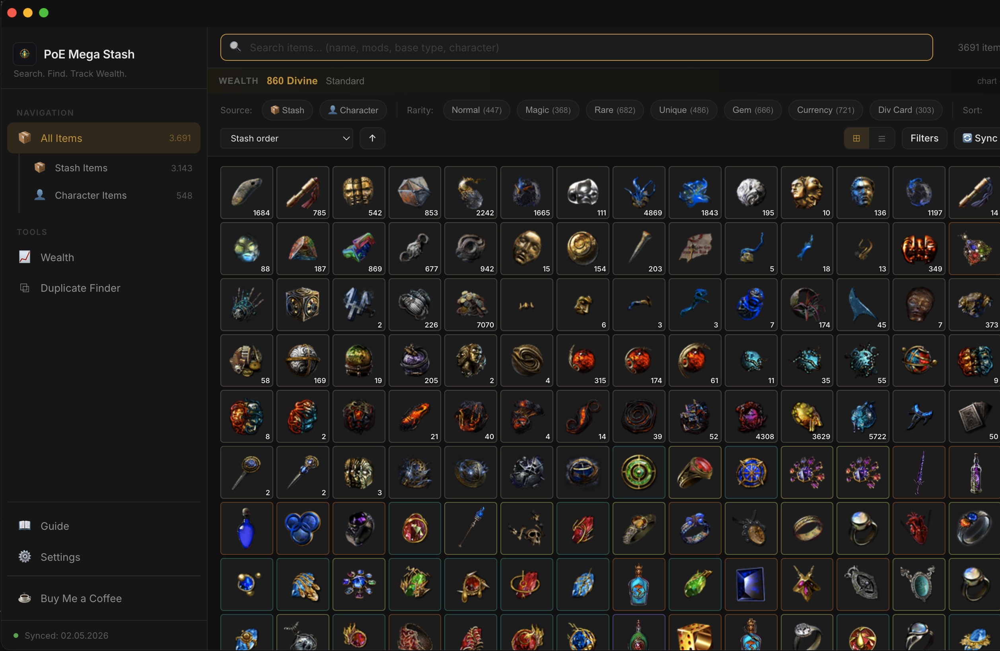
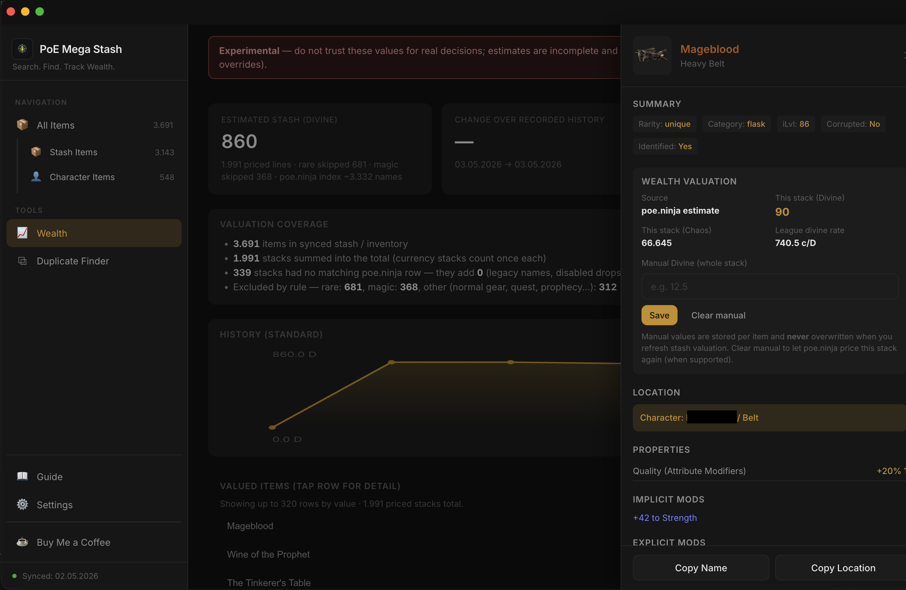

# PoE Mega Stash

Desktop companion for **Path of Exile** (PC): stash + character gear sync, search/filter, optional wealth estimate, duplicates, and **pathofexile.com trade** links from item mods.


## Screenshots

<table>
<tr>
<td align="center" width="50%"></td>
<td align="center" width="50%"></td>
</tr>
</table>

## Downloads

**Windows** (`.exe`) and **macOS** (`.dmg` / `.zip`) installers are on **[GitHub Releases](https://github.com/lumax90/poe-mega-stash/releases)**.

The packaged app checks Releases for updates on startup. When an update is ready, use **Update** next to **Settings** in the sidebar (install + restart).

Linux **AppImage** may appear in Releases when published.

---

## In-app guide

Open **Guide** in the sidebar (next to **Settings** at the bottom) — same Markdown as this file.

**Requirements (from source):** Node.js 18+, npm, and a Path of Exile account you may use with GGG’s APIs.

---

## First-time setup

1. **Settings** → account **Name** (e.g. `Account#1234`) + **`POESESSID`** from pathofexile.com cookies (like a password). Pick **League** → **Save**.
2. OAuth is optional if you see **Connect with PoE**.
3. **Sync All Items** when prompted and wait.

---

## Using the app

- **Sidebar**: All Items / stash vs character shortcuts; **Wealth**, **Duplicate Finder** when available; **Guide**, **Settings**, update control beside Settings.
- **Toolbar**: search, source, rarity, sort, sync, **Advanced** filters; grid/list.
- **Item**: detail panel, trade search from mods, optional Divine override where supported.
- **Wealth** is experimental — read the disclaimer on that screen.

**Tips:** correct **League** before sync and trade; re-sync after league changes.

---

## Privacy

Data stays **local**. Not affiliated with GGG — see their [terms](https://www.pathofexile.com/legal/terms-of-use-and-privacy-policy). APIs can change; report issues in this repo.

---

## Build from source

```bash
git clone https://github.com/lumax90/poe-mega-stash.git
cd poe-mega-stash
npm install
npm run dev
```
